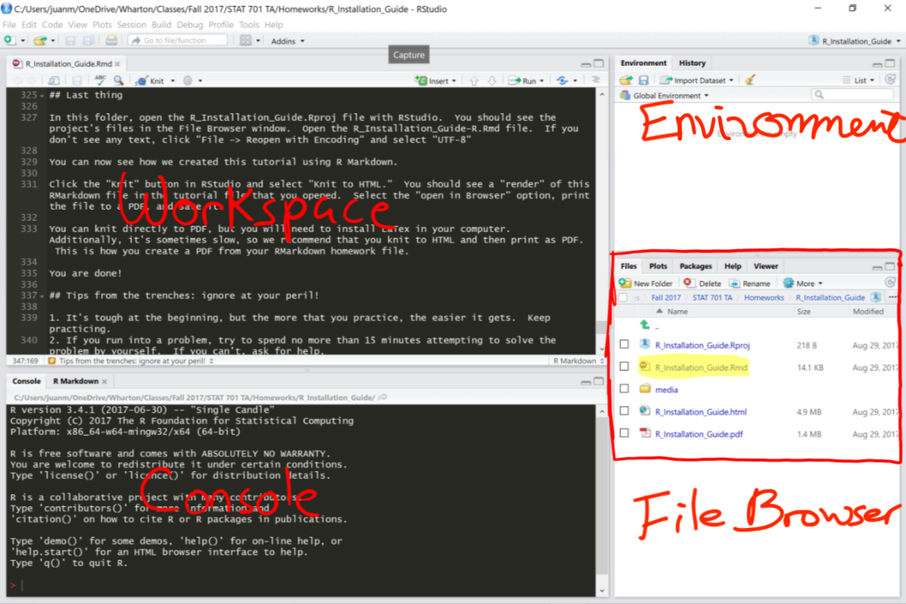
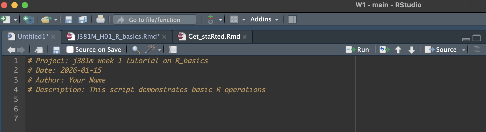
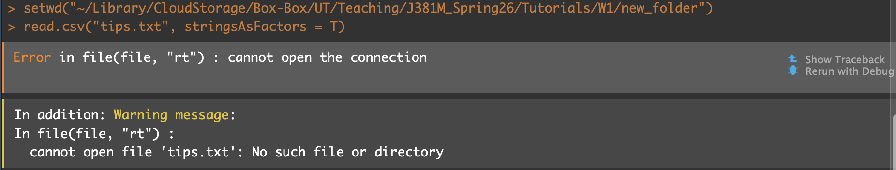
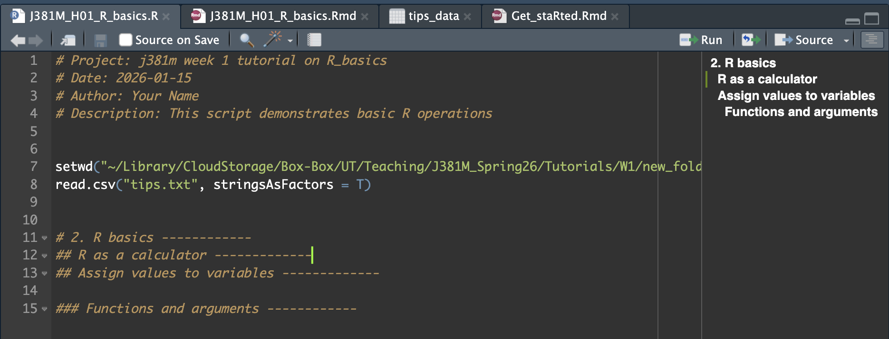

```{r setup, include=FALSE}
# this is the chunk for setting up the environment. It will not be included in the final output (include=FALSE). Run it before you run the following chunks.
knitr::opts_chunk$set(echo = TRUE, fig.width=8, fig.height=4)
options(scipen = 0, digits = 3)  # controls base R output
```

\pagebreak

# Objectives {-}

This tutorial is designed to get you up and running with R as quickly as possible. If you have any questions, come to office hours (TH 9:30-10:30am, DMC 3.370), or ask questions on Slack in our class channel #j381m.

Contents for today:

0. Pre-check:  
    + Get R and RStudio installed and set up to the latest version
    + Downloaded the handouts folder from Canvas and saved it to your local computer
    + Make sure your dataset is in the same folder with the Rmd file. 
    
1. R studio and R script
    + R studio interface tour
    + Create a new R project
    + Create a new R script file: File -> New File -> R Script

2. R basics
    + R as a calculator
    + Assign values to variables
    + Functions and arguments
    + Packages ("dplyr" as an example)
    + Pipe operator "|>"
    + Play with the sample dataset "tips" (try simple modeling)
    + Save the results

Now let's start!

# R studio Interface {-}

This is how RStudio looks like:

By default, the layout is as follows:

* Workspace: This is where you type codes.
* Console: This is where your outputs will show up.
* Environment/History: If you create any variables or import datasets, they will show up here.
* Files/Plots/Packages/Help: This is where you can see your files, plots, installed packages, and R help files.



# Create a new R project {-}

1. Click on "File" -> "New Project..."
2. Select "Existing Directory"
3. Browse to the folder where you saved the handouts and click "Create Project"

Why do we need to create a new project? It is a good working habit to keep all your files (R scripts, datasets, outputs) in one folder. R projects help you manage your working directory easily.

# Create a new R script {-}
Once you have created a new R project, you can create a new R script file within the project.It is okay if you do not want to create a new project. You can start a new R script file directly by clicking on "File" -> "New File" -> "R Script".

We skip the R markdown for the sake of time, but you can explore my handout file after class to understand how an R markdown works differently from an R script. (R markdown is a great tool for creating reproducible reports that combine code, output, and narrative text.)

# R as a calculator {-}

On your new R script file, you can start typing your R codes. I often start by typing comments (lines starting with #) to describe what I am doing. Comments are not executed as R codes.

A keyboard shortcut for commenting/uncommenting lines: On mac: Command + Shift + C; On windows: Ctrl + Shift + C -> try this by yourself!



The basic logic of coding: you talk to the computer, to get it do something for you. Coding is about how you talk to a computer. (programming languages are just languages that computers can understand.)

Using R is similar to a calculator: type 381 + 100. But instead of hitting an 'equals' button, you execute the code to run the calculation.

How to execute this line of code in R script? You can either click the "Run" button on the top right of the script panel, or use keyboard shortcuts: on Mac: Command + Return; on Windows: Ctrl + Enter.

```{r calculator}
381 + 100
```

You can also type this directly in the console and hit enter to get the result. The only difference is that you cannot reuse the code later if you type it in the console. When you want to try something and see the immediate result, you can test it in the console.

# R variables {-}

Now that you know how to write and execute R code, let's try some basic operations.

You can assign values to variables using the assignment operator `<-`. For example, let's assign the value 10 to a variable named `x`:

```{r assign_variable}
x <- 10 # do not use "=" for assignment in R!
```

Here, `x` is the name of the variable, and `10` is the value being assigned to `x`. `<-` is the assignment operator that links `x` to `10`. You can then use `x` in subsequent calculations:

```{r use_variable}
y <- x + 5
y
```

I can also use a variable to represent a vector of numbers:

```{r vector_variable}
my_numbers <- c(1, 1, 2, 3, 4, 5)
my_numbers
```

Or assign a string value to a variable:
```{r string_variable}
my_string <- "Hello, R!"
my_string
```

Here is a question: Create a variable named `z` that represents the result of multiplying `x` by 3. What is the value of `z`? Show me your code to calculate `z`.

```{r multiply_variable, echo=FALSE}
z <- x * 3
z
```

# R functions {-}

Functions are pre-defined operations that perform specific tasks. You can use functions to perform calculations, manipulate data, and more. Functions typically have a name followed by parentheses `()`, which may contain arguments (inputs) for the function.

For example, the `sum()` function calculates the sum of a vector of numbers:
```{r sum_function}
sum(my_numbers)
```
You can also store the result of a function in a variable:
```{r sum_function_named}
total_num <- sum(my_numbers)
total_num
```
Here are some commonly used pre-built functions in R:
```{r functions}
max_num <- max(my_numbers) # get the maximum value from the vector
max_num
min_num <- min(my_numbers) # get the minimum value from the vector
min_num
unique_nums <- unique(my_numbers) # get the unique values from the vector
unique_nums
duplicated_nums <- duplicated(my_numbers) # check for duplicated values in the vector
duplicated_nums
```

Now we know what a function is. Next, let's see how to use arguments within functions. Arguments are values that you pass to a function to customize its behavior. For example, the `round()` function rounds numbers to a specified number of decimal places. It has two arguments: the number to be rounded and the number of decimal places.

```{r round_function}
rounded_value <- round(3.14159, digits = 2) # round to 2 decimal places
rounded_value
```

Or you can do this
```{r round_function_no_arg_name}
rounded_value2 <- round(3.14159, 3) # round to 3
rounded_value2
```

A slightly more challenging task: define your own function.
```{r define_function}
multiply_by_two <- function(x) { # define a function named multiply_by_two that takes one argument `x`
  result <- x * 2 # multiply the input `x` by 2 and store the result in a variable named result
  return(result) # return the result
}
multiply_by_two(5)
```
Using this function, can you define a new function named `add_five` that takes one argument and adds 5 to it? Show me your code.

# Reading data {-}

Now, let's use a function to import data. In R, you can read data from various file formats, such as CSV, Excel, and RDS. The most common format is CSV (Comma-Separated Values).

We often use the `read.csv()` function to read CSV files. The basic syntax is as follows:

```{r read_data}
tips_data <- read.csv("tips.txt", stringsAsFactors = T) # while this is a .txt file, it is actually in csv format (comma separated values)
```
Here, `tips_data` is the name of the variable that will store the imported data, and `"data/tips.txt"` is the file path to the CSV file. The argument `stringsAsFactors = T` tells R to treat string variables as factors (categorical variables). - we will talk more about data types next week.

Sometimes if you see a new function, and you do not know how to use it, you can read its document by using the `help()` function or the `?` operator. For example, to learn more about the `read.csv()` function, you can type:

```{r help_read_csv, eval=FALSE}
help(read.csv)
# or
?read.csv
```
Alternatively, you can ask AI or google it.

# Path and work directory {-}
R needs to know where to find your data files. The folder where R is currently looking for files is called the "working directory". You can check your current working directory by using the `getwd()` function:
```{r get_working_directory}
getwd()
```
By default, the working directory is set to the folder where your R project is located. If you want to change the working directory, you can use the `setwd()` function. For example, to set the working directory to a specific folder, you can do:
```{r set_working_directory, eval=FALSE}
setwd("new_folder/") # this name is short if the folder is in the current working directory
# or
setwd("~/Library/CloudStorage/Box-Box/UT/Teaching/J381M_Spring26/Tutorials/W1/new_folder") # this is the full path, and it can be anywhere on your computer
```

What happens if you do not set the working directory correctly? R will not be able to find your data files, and you will get an error when you try to read a file. For example, if you rerun the `read.csv()` function without setting the working directory correctly, you might see an error like this:

Okay, let's stick with the correct working directory for now.

# Exploring data (and try some functions in packages) {-}

Let's assign a name to the imported dataset for later use.
```{r assign_dataset}
tips_data <- read.csv("tips.txt", stringsAsFactors = T) # after we run this line, there will be a new dataset named tips_data in the environment panel
```

Usually, after importing a dataset, we want to take a quick look at it to understand its structure and contents. Here are some useful functions to explore the dataset:
```{r explore_data}
head(tips_data) # this will give you the first six rows of the dataset
colnames(tips_data) # this will give you the column names of the dataset
dim(tips_data) # this will give you the dimensions of the dataset (number of rows and columns)
str(tips_data) # this will give you the structure of the dataset (data types of each column)
summary(tips_data) # this will give you a summary of the dataset (statistical summary for numeric columns, frequency for categorical columns) 
```

# Packages {-}

Sometimes a function is built within a package. We need it because we want to use a function inside of it.
A package is a collection of R functions, data, and compiled code that extends the capabilities of R. There are thousands of packages available for various purposes, such as data manipulation, visualization, statistical analysis, and more.

To use a package in R, you first need to install it (only once) using the `install.packages()` function. For example, to install the "dplyr" package, you can run:
```{r install_package, eval=FALSE}
install.packages("dplyr") # be sure to include the quotation marks around the package name
```

Usually you only need to install a package once. Sometimes if you are not sure if you have the package installed, you can run the install command again, and R will check if it is already installed.

After installing a package, you need to load it into your R session using the `library()` function. For example, to load the "dplyr" package, you can run:
```{r load_package}
library(dplyr) # no quotation marks needed when loading a package
```

Once we have loaded the package, we can use its functions. For example, the "dplyr" package provides functions for data manipulation, such as `filter()`, `select()`, `mutate()`, and more.

Here is an example of using the `filter()` function from the "dplyr" package to filter rows in the `tips_data` dataset where the `total_bill` is greater than 40:

```{r dplyr_example}
filter(tips_data, tips_data$total_bill > 40) # tips_data is the dataset that this function is applied to, and tips_data$total_bill > 40 is the condition for filtering; we use `$` to specify the column within the dataset
```

Actually, a cool thing about "dplyr" is that it works really well with the pipe operator `|>`, which allows you to chain multiple operations together in a more readable way. For example, we can rewrite the previous filtering operation using the pipe operator:
```{r dplyr_pipe_example}
tips_data |>
  filter(total_bill > 40) # here we do not need to specify the dataset name again, because the pipe operator passes the dataset to the next function automatically
```

You might see people use `%>%` as the pipe operator, which is from the "magrittr" package. The native pipe operator `|>` was introduced in R 4.1.0, and it works similarly to `%>%`. You can use either one based on your preference.

A small task for you: Using the `dplyr` package and the pipe operator, filter the `tips_data` dataset to include only rows where the `tip` is greater than 5. Show me your code.


# Play with the data using R {-}

Now that we have learned some basic R operations and how to use packages, let's try to do some simple data analysis and visualization using the `tips_data` dataset.

Let’s propose an question here, based on the data: what is the relationship between `tip` and `time`? Does dinner often come with a higher tip?
```{r simple_regression}
lm(tip ~ time, data = tips_data) # in this line, can you tell me what is lm()? what does “data =” mean? 
```
This is a linear regression model generated by lm(). We need to interpret the output of this model. 

```{r simple_regression_interpretation, eval=FALSE}
model <- lm(tip ~ time, data = tips_data) # save your regression as an object 
summary(model) # this is a function to show you the detailed results of the model
``` 

How to read the summary results? Estimates tell you the direction and magnitude of the relationship. The p-value tells you whether the relationship is statistically significant. 

In this case, we can see that lunch is associated with a lower tip compared to dinner (-0.38 dollar), and the relationship is not statistically significant at the 95% confidence level (The p-value is 0.058, which is slightly higher than the standard cutoff of 0.05.). Therefore, we cannot definitively say there is a true difference between Lunch and Dinner tips based on this data alone, though there is a trend suggesting Lunch tips might be lower.

We will skip other details from this model interpretation for now, and revisit it in later class.


# Save the results {-}

Finally, once you are done with analysis, you should save the objects that need to be saved for future use. You can use the `saveRDS()` function to save an R object to a file, and the `readRDS()` function to read it back into R later.

```{r save_rds}
saveRDS(tips_data, file = "tips_data.rds") # save the dataset to a file named "tips_data.rds"
```

Do not forget to save your R script file as well! You can click on "File" -> "Save" or use the keyboard shortcut: On Mac: Command + S; On Windows: Ctrl + S.

# A few last notes on R coding {-}
  * Always comment your code! Use `#` to add comments. This is super helpful when you have hundreds of lines, before you forget what you are doing in a single section. And you can easily create sections in R scripts using comments.


  * Try Copilot or AI tools to help you write code faster. But always double-check the code generated by AI tools, as they may not always be correct or optimal. Enable Copilot on R studio: Tools -> Global Options -> GitHub Copilot -> Enable GitHub Copilot ([Follow the guidance here](https://docs.posit.co/ide/user/ide/guide/tools/copilot.html))

  * Practice makes perfect! The more you practice coding in R, the more comfortable you will become. Try to solve small problems using R, and gradually increase the complexity of your tasks. 
  Resources for you to explore: [R for Data Science](https://r4ds.hadley.nz/) is a great resource to learn more about R and data science. Also check out [R documentation](https://www.rdocumentation.org/) for more functions and packages. Additionally, [Jo's J381M textbook](https://jolukito.quarto.pub/j381m-textbook/) provides a very beginner-friendly introduction to R programming and data analysis.
  
  * Don't be afraid to ask for help! If you get stuck, reach out to your classmates, instructors, or online communities like Stack Overflow or RStudio Community. Learning to code is a journey, and it's okay to seek assistance along the way.
