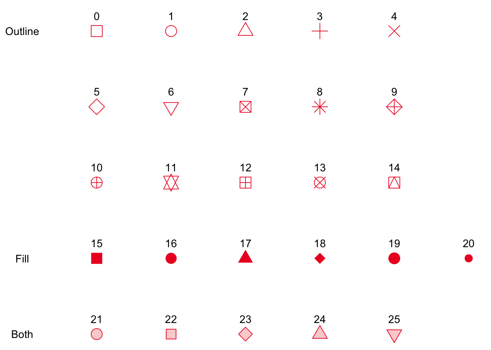

```{r setup, include=FALSE}
# this is the chunk for setting up the environment. It will not be included in the final output (include=FALSE). Run it before you run the following chunks.
knitr::opts_chunk$set(echo = TRUE, fig.width=8, fig.height=4)
options(scipen = 0, digits = 3)  # controls base R output
```

\pagebreak

# Objectives {-}

Welcome back to J381M! 

This week, we will learn more about visualization skills using the ggplot2 package. Throughout this semester, you have already encountered this package for some simple illustrations. But ggplot is much more powerful than what we have used so far. This week, let's look into this package in more depth and learn how to use it to make the results more interpretable and presentable.

The basic idea of `ggplot` is to independently specify building blocks and combine them to create just about any kind of graphical display you want. Building blocks of a graph include:

+ data
+ aesthetic mapping
+ geometric object
+ faceting


Content of today:

0. read the data

1. ggplot: aesthetic mapping with different models
 - one continuous variable: histogram
 - one continuous + one categorical variable: boxplot
 - two continuous variables: scatter plot
 - three continuous variables: scatter plot with size aesthetic
 - two continuous + one categorical variable: scatter plot with color aesthetic
 - linear model line quickly: geom_smooth()
 - trend: geom_line() and geom_bar()
 - faceting
2. multiple plots: `ggpubr::ggarrange()`
3. saving plots: `ggsave()`
4. Bonus learning: `plotly` package for interactive visualization
5. ggplot: theming
6. ggplot: scale
    
Let's get started!

# Read the data {-}

We now use the `gapminder` from the package gapminder. Let's do a quick summary.

```{r}
library(ggplot2) # for plotting
library(dplyr)
library(skimr) 
#install.packages("gapminder")
library(gapminder) # where the data is stored

# preview the data
skim(gapminder)
```

# Aesthetic Mappings {-}

In `ggplot` land aesthetic means "something you can see". Examples include:

+ position (i.e., on the x and y axes)
+ color ("outside" color, the color of the points or lines)
+ fill ("inside" color)
+ shape (of points)
+ size


How do we select the appropriate plot type? By data type [categorical vs. continuous]

|**Data** | **Plots** | **Geom (ggplot command)**|
|----------------------------------|----------------------|----------------------------|
| One Continuous | Histogram | geom_histogram |
| One Continuous + One Categorical | Boxplot | geom_boxplot |
| Two Continuous | Scatter Plot | geom_point |
| Three Continuous | Scatter Plot + Size | geom_point w/ size aesthetic |
| Two Continuous + One Categorical | Scatter Plot + Color | geom_point w/ color aesthetic |
| Categorical with reasonable number of levels  | Faceting!! |  facet_wrap() |

**Note: Time is always the x-axis.**

There are many more geom types, but we will focus on the ones listed in the table above.

[The ggplot cheatsheet](https://posit.co/wp-content/uploads/2022/10/data-visualization-1.pdf) is an extremely useful cheatsheet that shows all of ggplots functions and how to use them.

## One Continous /  Geom_Histogram {-}

The following shows the histogram of life Expectancy in 2007. Life expectancy `lifeExp` is a continuous variable, so we use `geom_histogram()`.

Note how the `%>%` or "piping" also works with ggplot. If you are not piping in a dataframe, the first input to ggplot should be your dataframe. For example, the command would become `ggplot(gapminder, aes(x = lifeExP)) + geom_histogram(binwidth = 2)`

```{r}
hist(gapminder$lifeExp)

gapminder %>%
  ggplot(aes(x = lifeExp)) + 
  geom_histogram(binwidth = 2) # you have more control than the default hist function in R; try binwidth = 10

# if you want to save the plot into an object, you can do it like this: 

p <- ggplot(gapminder, aes(x = lifeExp)) + 
  geom_histogram(binwidth = 2)
p

```
## One Continuous + One Categorical / Geom_boxplot {-}

Now, we want to show `lifeExp` broken down by continent. `Continent` is a categorical variable, also called factors in R. For this, we use the `geom_boxplot()` command. 

```{r}
gapminder %>%
  filter(year == 2007) %>%
  ggplot(aes(x = continent, y = lifeExp)) + 
  geom_boxplot()
```


## Two Continous / Geom_Point {-}

Using `geom_point()` we create a scatter plot of our two continuous variables, `gdpPercap` and `LifeExp`.

```{r}
plot(gapminder$gdpPercap, gapminder$lifeExp, pch=16)
gapminder %>%
  filter(year == 2007) %>%
  ggplot(aes(x = gdpPercap, y = lifeExp)) + 
  geom_point()
```

Some relationships will look better on different scales, and ggplot allows you to change scales very quickly. Here we log the x-axis, with `scale_x_log10()`, which makes the relationship between these two variables much clearer. Use `size` and `shape` argument in `geom_point()` to adjust the size and the shape.
The options of shape is indexed as follows.


*Credit to https://blog.albertkuo.me/post/point-shape-options-in-ggplot/*

```{r, message=FALSE}
gapminder %>%
  filter(year == 2007) %>%
  ggplot(aes(x = gdpPercap, y = lifeExp)) + 
  geom_point(size = 1, shape = 5) +
  scale_x_log10() ## did you notice the change in x-axis? Try to remove this line and see how the graph changes.
```

## Three Continuous / Geom_point With Size Aesthetic {-}

If we want to show three continous variables at the same time, we can use the size aesthetic in ggplot. This will alter the size of the point by the value in the `pop` column of the gapminder data frame.

```{r, message=FALSE}
gapminder %>%
  filter(year == 2007) %>%
  ggplot(aes(x = gdpPercap, y = lifeExp, size = pop)) + # population is the new variable we add to this plot
  geom_point() +
  scale_x_log10()
```


## Three Continuous + One Categorical / Geom_point With Color Aesthetic {-}

To show more insight into this graph, we can show each point by which continent it is from. Adding the color Aesthetic allows us to show a categorical variable, `continent`, as each point is colored by what continent it is from.

```{r, message=FALSE}
gapminder %>%
  filter(year == 2007) %>%
  ggplot(aes(x = gdpPercap, y = lifeExp)) + 
  geom_point(aes(size = pop, color = continent)) + # by specifying the color argument, we add one more information layer to this visual
  scale_x_log10()
```

## Linear model line quickly / Geom_smooth {-}

`ggplot` can also quickly add a linear model to a graph. There are also other models geom_smooth can do ("lm", "glm", "gam", "loess", "rlm"). If you leaving it blank it will automatically choose one for you, but that is not recommended. 

To add the linear model line, we add `geom_smooth(method = 'lm', se = TRUE)` to the command. `se = TRUE` tells it to plot the standard error ranges on the graph.  

```{r,message=FALSE}
gapminder %>%
  filter(year == 2007) %>%
  ggplot(aes(x = log(gdpPercap), y = lifeExp)) + 
  geom_point(aes(col = continent)) + 
  geom_smooth(method = 'lm', formula = 'y~x', se = TRUE)
```

This does not look right, because the linear model line is plotted for the whole data, but we want to plot the linear model line for each continent. To do that, we need to move `aes(col = continent)` from `geom_point()` to `ggplot()`.

Note that `aes()` in `ggplot()` is a global setting, it will affect all geometric objects. It is the best practice to put aesthetic setting for each geometric objects. See the difference in the next plot.

```{r,message=FALSE}
gapminder %>%
  filter(year == 2007) %>%
  ggplot(aes(x = log(gdpPercap), y = lifeExp, col = continent)) + 
  geom_point() + # here we move the aes() to ggplot() so that it applies to all geoms, and leave geom_point() empty
  geom_smooth(method = 'lm', formula = 'y~x', se = TRUE)
```

## Trend {-}

So far we have been plotting a cross-sectional plot. 
We can use `geom_line()` with x-axis as `year` and y-axis as `life expectancy`.
We plot the trend of life expectancy of US.

```{r}
gapminder %>%
  filter(country == "United States") %>%
  ggplot(aes(x = year, y = lifeExp)) +
  geom_line()
```

Now we want to plot the life expectancy trend of each country.
We call it the **spaghetti plot**.
We need to tell `geom_line()` to `group` the line by `country`. 
We use different colors to separate continents.

```{r}
gapminder %>%
  ggplot(aes(x = year, y = lifeExp)) +
  geom_line(aes(group = country, col = continent))
```

It is a bit hard to see the pattern. 
We can add the trend of mean of each continent in our plot. 
In addition to the trend, we need to call another `geom_line()`
to plot the mean. To make the mean trend stand out, 
we set `alpha` for the transparency of the spaghetti.

```{r}
gapminder %>%
  ggplot(aes(x = year, y = lifeExp)) +
  geom_line(aes(group = country, col = continent), alpha = .2) +
  geom_line(data = gapminder %>% 
              group_by(continent, year) %>% 
              summarise(mean = mean(lifeExp)),
            aes(x = year, y = mean, group = continent, col = continent), 
            size = 1)
```

Another trend plot is that we want to see how each group changes.
We can use barplot with `fill` by each group. 
There are three position options for `geom_bar()`:

* **stack**: stacking number of each group together
* **dodge**: spread out each group
* **fill**: get the proportion of each group

```{r}
gapminder %>%
  ggplot(aes(x = year, y = pop, fill = continent)) + 
  geom_bar(position = "stack", stat = "identity") 
```
```{r}
gapminder %>%
  ggplot(aes(x = year, y = pop, fill = continent)) + 
  geom_bar(position = "fill", stat = "identity") 
```


## Faceting {-}

Instead of changing the color of points on the graph by continent, you can also create a different graph for each continent by 'faceting'. Depending on the number of factors and your dataset, faceting may look better than just changing colors. To do this we add the `facet_wrap(~ continent)` command. 

```{r,message=FALSE}
gapminder %>%
  filter(year == 2007) %>%
  ggplot(aes(x = gdpPercap, y = lifeExp)) +
  geom_point() +
  scale_x_log10() +
  facet_wrap(~continent)
```

You can facet with any geom type. For example, our spaghetti plot. 
```{r}
gapminder %>%
  ggplot(aes(x = year, y = lifeExp)) +
  geom_line(aes(group = country, col = continent), alpha = .2) +
  geom_line(data = gapminder %>% 
              group_by(continent, year) %>% 
              summarise(mean = mean(lifeExp)),
            aes(x = year, y = mean, group = continent, col = continent), 
            size = 1) +
  facet_wrap(~ continent)
```


Another example, linear model of each continent. We can use `scales = "free"` in `facet_wrap()`
to free the scales of x, y axes. It is generally NOT recommend to do so since 
it can be misleading.
```{r,message=FALSE}
gapminder %>%
  filter(year == 2007) %>%
  ggplot(aes(x = log(gdpPercap), y = lifeExp)) + 
  geom_point() + 
  geom_smooth(method = 'lm', formula = 'y~x', se = TRUE)+
  facet_wrap(~ continent)
```

# Multiple plots: `ggpubr::ggarange()` {-}

To put multiple plots together, use `ggarrange()` from `ggpubr` package. 

```{r}
library(ggpubr)
p1 <- gapminder %>%
  ggplot(aes(x = year, y = lifeExp)) +
  geom_line(aes(group = country, col = continent), alpha = .2) +
  geom_line(data = gapminder %>% 
              group_by(continent, year) %>% 
              summarise(mean = mean(lifeExp)),
            aes(x = year, y = mean, group = continent, col = continent), 
            size = 1)

p2 <- gapminder %>%
  ggplot(aes(x = year, y = pop, fill = continent)) + 
  geom_bar(position = "stack", stat = "identity") 

# put p1 and p2 together
p <- ggpubr::ggarrange(p1, p2, common.legend = T, legend = "bottom", ncol = 2)
annotate_figure(p,
               top = text_grob("Life expectancy and Population", 
                               color = "black", face = "bold", size = 14))
```

# Saving plots `ggsave()` {-}

Use `ggsave()` to save plots to png, jpeg or pdf. It plots the previous plot until we specify which plot to save.
```{r}
ggsave(filename = "fig/life_exp_population.pdf", width = 8, height = 5)
```

# `plotly` package {-}

Plotly is an interactive web-based library. It is well-integrated with `ggplot2` via `ggplotly()`.
You can feed in any ggplots to `ggplotly()`, it will output 
an interactive plot. Note that since it is web-based, it only 
works when you knit to html.

```{r}
#install.packages("plotly")
library(plotly)
p <- gapminder %>%
  ggplot(aes(x = year, y = lifeExp)) +
  geom_line(aes(group = country, col = continent), alpha = .2) +
  geom_line(data = gapminder %>% 
              group_by(continent, year) %>% 
              summarise(mean = mean(lifeExp)),
            aes(x = year, y = mean, group = continent, col = continent), 
            size = 1)

ggplotly(p)
```

## Animation {-}

One thing worth mentioning is animation with plotly. Use `frame` argument.

```{r}
p <- ggplot(gapminder, aes(gdpPercap, lifeExp, color = continent)) +
  geom_point(aes(size = pop, frame = year, ids = country)) +
  scale_x_log10()

fig <- ggplotly(p)

fig
```

# Theming {-}

`ggplot` makes it very easy to create very nice graphs, using whats called a theme. There are many default themes or you can make your own. Almost everything is customizable on ggplot, including sizes, colors, font types, etc. Below is a example of building a theme.

To use a theme, it is simply added on the end of your ggplot string of commands. You can also add titles with `ggtitle()`, change labels with `xlab()` and `ylab()` command. 
```{r,echo=FALSE, warning=FALSE}
theme_new <- theme_bw() +
  theme(plot.background = element_rect(size = 1, color = "blue", fill = "black"),
        text=element_text(size = 12, family = "Courier", color = "yellow"),
        axis.text.y = element_text(colour = "purple"),
        axis.text.x = element_text(colour = "red", angle = -30, hjust = 0, vjust = 1),
        panel.background = element_rect(fill = "pink"),
        strip.background = element_rect(fill = "orange"),
        legend.background = element_rect(fill = "black"))

gapminder %>%
  filter(year == 2007) %>%
  ggplot(aes(x = log(gdpPercap), y = lifeExp)) + 
  geom_point(aes(col = continent)) +
  geom_smooth(method = 'lm', formula = 'y~x', se = TRUE) + 
  ggtitle("Life Expectancy by GDP per Capita") + 
  xlab("log(GDP per Capita)") + 
  ylab("Life Expectancy") + theme_new

```

# Scale {-}

We might want to change the label or color of the legend. Scale family will come in handy.

We can use `scale_color_brewer()` or `scale_fill_brewer()` with `palette` argument 
depends on you are using `col` or `fill` aesthetics.
Here are the available palettes:

* Diverging: BrBG, PiYG, PRGn, PuOr, RdBu, RdGy, RdYlBu, RdYlGn, Spectral
* Qualitative: Accent, Dark2, Paired, Pastel1, Pastel2, Set1, Set2, Set3
* Sequential: Blues, BuGn, BuPu, GnBu, Greens, Greys, Oranges, OrRd, PuBu, PuBuGn, PuRd, Purples, RdPu, Reds, YlGn, YlGnBu, YlOrBr, YlOrRd

```{r}
gapminder %>%
  filter(year == 2007) %>%
  ggplot(aes(x = log(gdpPercap), y = lifeExp)) + 
  geom_point(aes(col = continent)) +
  scale_color_brewer(palette = "Spectral", 
                     labels = c("AFRICA", "AMERICA", "ASIA", "EUROPE", "OCEANIA")) + 
  labs(colour = "CONTINENT")

```

```{r}
gapminder %>%
  ggplot(aes(x = year, y = pop, fill = continent)) + 
  geom_bar(position = "stack", stat = "identity") +
  scale_fill_brewer(palette = "Spectral", direction = -1)
```


We can also [scale by manual](https://ggplot2.tidyverse.org/reference/scale_manual.html)
or [scale by gradient](https://ggplot2.tidyverse.org/reference/scale_gradient.html) for continous variable.

Acknowledgement: Credit of this session to Linda Zhao's Modern Data Mining Class, 2021


