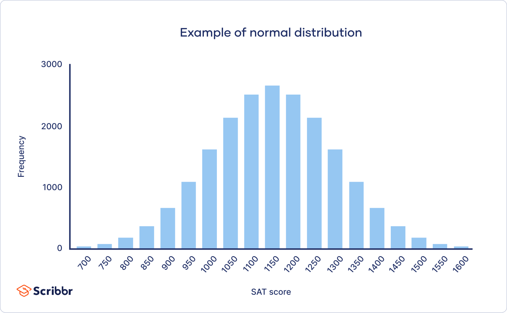

```{r setup, include=FALSE}
# this is the chunk for setting up the environment. It will not be included in the final output (include=FALSE). Run it before you run the following chunks.
knitr::opts_chunk$set(echo = TRUE, fig.width=8, fig.height=4)
options(scipen = 0, digits = 3)  # controls base R output
```

\pagebreak

# Objectives {-}

Welcome back to J381M! 

In this tutorial, we will move beyond basic R syntax and start analyzing our data. This process is called Exploratory Data Analysis (EDA). 

Why do we need EDA? EDA can help us understand the data better, identify patterns, detect anomalies, test hypotheses, and check assumptions. In short, EDA is a crucial step in the data analysis process that can lead to more accurate and insightful results.

Content of today:

0. Pre-check:  
    + Downloaded the handouts folder from Canvas
    + Start a new R script in R studio in your j381m project folder
    + Make sure the practice sample dataset "tips.csv" is in your j381m project folder
    
1. Data Inspection
    + Understand the shape of the data (rows, columns, and data types)
    + Check missing values
    + Fixing data types if necessary for analysis later

2. Univariate Analysis: Take a look at one variable, to understand it a bit more before analysis
    + Numerical variable: mean, standard deviation (SD), range (quartiles), distribution (histogram, boxplot)
    + Categorical variable: frequency table, bar plot

3. Bivariate Analysis: to understand the relationship between two variables of interest (take a look at it, not yet formal analysis)
    + Numerical ~ Categorical: summarize numerical by category, group_by() and summarize()
    + Numerical ~ Numerical: scatter plot, correlation


# Read the data {-}
We will continue using the tidyverse package, which contains tools for data manipulation (dplyr) and visualization (ggplot2).

```{r read_data}
library(tidyverse) # load the tidyverse package
library(ggplot2) # load ggplot package for visualization
# check the version of it, before it creates issues later
packageVersion("tidyverse") # should be 1.3.2 or above
packageVersion("dplyr") # should be 1.0.0 or above
packageVersion("ggplot2") # should be 3.3.0 or above

# read the CSV file into an object called 'df'
df <- read.csv("baseball_data.csv")
# Do you see 'df' appears in your Environment pane (top right)?
```

# Data Inspection {-}

Let's first take a look at the structure of the data frame `df` to get an idea of how many observations (rows) and variables (columns) it contains. We use `dim()` function for this purpose.

```{r data_dimensions}
dim(df) # get the dimensions of the data frame

colnames(df) # what are the variables in the data frame?
```

What are the data types of each variable? We can use the `str()` function to check the structure of the data frame, which includes information about the data types of each variable.

```{r data_type}
str(df) # check the structure of the data frame
```
Now, we learn that this dataset is about baseball teams' payroll information, with 510 observations (rows) and 5 variables (columns), including their numbers of winning games and payrolls in different years.

From the output of `str()`, can you tell me which variable is categorical and which variable is numerical?

[For your information: <chr> means character (categorical variable), <int> means integer (numerical variable), and <dbl> means double. This is the data type. In programming, a "double" is a double-precision floating-point number. In plain English, this simply means a number that contains decimals. (numerical variable).]

Before we analyze the data, we also need to check whether there are any missing values in the dataset. We can use the `is.na()` function along with `colSums()` to count the number of missing values in each column.
```{r missing_values}
colSums(is.na(df)) # count missing values in each column
```

This result indicates that there is one missing value in the `payroll` variable, and two missing values in `win_pct`. 

Let's take a closer look at them:
```{r view_missing}
df[is.na(df$payroll) | is.na(df$win_pct), ] #
# view rows with missing values in payroll or win_pct
```

Missing values are common in real-world datasets. Sometimes they are identifiable as "NA", but other times they may be represented by other placeholders like -99, 999, or a blank space " ". It is important to identify and handle missing values appropriately before conducting any analysis.

Depending on the context of the analysis, we may choose to handle these missing values by either removing the rows with missing values or imputing them with a specific value (e.g., mean or median). For now, we will leave them as is.

For analysis, categorical variables like team or grouping variables like year are often better handled as Factors.

```{r convert_factor}
df$team <- as.factor(df$team) # convert team variable to factor

# convert 'year' to a factor (useful if we want to treat years as discrete groups)
df$year <- as.factor(df$year)

# take a look the change again
str(df)
```

Note: in some cases, converting variables may lead to loss of information. For example, if you convert a numerical variable to a factor, you will lose the ability to perform numerical operations on that variable. Also, if you convert a variable to a factor, make sure that the levels of the factor are meaningful and relevant to your analysis. Therefore, it is important to carefully consider the implications of converting variables before doing so.

# Univariate Analysis {-}

Univariate analysis involves examining the distribution and characteristics of a single variable. Let's start with numerical variables.

Here, we want to further understand the variable of `payroll` before we analyze it. In most of cases, we care about the center (mean, median), spread (standard deviation, range), and distribution (histogram, boxplot) of a numerical variable.

```{r univariate_numerical}
summary(df$payroll) # quartiles, min, max, mean, median
sd(df$payroll) # standard deviation (the larger the SD, the more spread out the data is)

# or calculate specific stats at once using summarize()
df %>%
  summarize(
    mean_payroll = mean(payroll),
    sd_payroll = sd(payroll),
    min_payroll = min(payroll),
    max_payroll = max(payroll)
  )
```

We can visiualize the distribution of this variable using a histogram. As shown, the payroll variable is right-skewed, meaning that most teams have lower payrolls, but a few teams have very high payrolls.

```{r histogram}
hist(df$payroll, main="Histogram of Payroll", xlab="Payroll", col="lightblue", border="black") # use a histogram to take a look at the distribution
```

Sometimes we want to check whether there are outliers in the data. We use boxplot for this purpose. As shown in the boxplot, we can see that there are some outliers in the payroll variable, which are the points that fall outside the whiskers of the boxplot. These outliers represent teams with unusually high payrolls compared to the rest of the teams. 

```{r boxplot}
boxplot(df$payroll, main="Boxplot of Payroll", ylab="Payroll", col="lightgreen") # boxplot
```

Now, let's look at a categorical variable, such as `team`. For categorical variables, we often want to know the frequency of each category. We can use the `table()` function to create a frequency table.

```{r univariate_categorical}
table(df$team) # frequency table of team variable
```

If you want to look at it in a more straightforward way, you can use a bar plot to visualize the frequency of each category.

```{r barplot}
ggplot(df, aes(x = team)) + 
  geom_bar(fill = "darkgreen") + 
  coord_flip() + # Flips x and y axis so we can read the team names
  theme_minimal() +
  labs(title = "Number of Observations per Team")

# Here, we use ggplot() to visualize the distribution. ggplot() is a powerful tool for visualization in R, and we will discuss more later this spring. You can check help(ggplot) for more information.

# In this part of the code, x specifies the categorical variable (team), and geom_bar() creates the bar plot. Without further specification, geom_bar() will count the number of occurrences of each category in the team variable.

```

According to the table of team variable, we can see that observations for each team are not the same, indicating that we miss some observations for certain teams. For example, we only have 15 observations (rows) for `Toronto Blue Jays` , and 16 observations for `Texas Rangers`.


# Bivariate Analysis {-}

With some preliminary understanding of the data, we can now explore the relationships between two variables. Since we already see the variables, we may propose some questions. 

Question: which team spends the most on payroll on average?

We can use `group_by()` and `summarize()` functions from the dplyr package to calculate the average payroll for each team.

```{r bivariate_categorical_numerical}
df |>
  group_by(team) |> # what does this step do?
  summarize(avg_payroll = mean(payroll, na.rm = TRUE)) |> # we include na.rm = TRUE to make sure that missing values are ignored in the calculation
  arrange(desc(avg_payroll)) # arrange in descending order
```

Now it's your turn: which team has the highest average winning percentage? You can modify the code above to answer this question.

(Try it by yourself first, then check the answer by clicking the "SHOW" button.)

```{r class.source = "fold-hide", results='hide'}
df |>
  group_by(team) |> 
  summarize(avg_win_pct = mean(win_pct, na.rm = TRUE)) |> 
  arrange(desc(avg_win_pct))
```

Now we have another question: do teams with higher payrolls tend to have higher winning percentages?

By this question, we are speculating a relationship between two numerical variables: `payroll` and `win_pct`. We visualize a scattter plot to see the relationship between these two variables.

```{r bivariate_numerical}
ggplot(df, aes(x = payroll, y = win_pct)) +
  geom_point(alpha = 0.5) +             # alpha controls transparency
  geom_smooth(method = "lm", color = "red") + # Add linear trend line
  theme_minimal() +
  labs(title = "Payroll vs. Winning Percentage", 
       x = "Payroll (Millions)", 
       y = "Winning Percentage")
```

From the scatter plot, we can see a positive relationship between payroll and winning percentage, indicating that teams with higher payrolls tend to have higher winning percentages.(as payroll goes up, wins go up, although the relationship is not very strong, since the dots are scattered)


# [Extended Content: Correlations] {-}

We can also do a simple correlation test to quantify the strength of the relationship between these two numerical variables. 

To test correlations, we need to decide whether to use Pearson's correlation or Spearman's correlation. Both are applied for numerical values. If we want to use Pearson's correlation, we need to check whether both variables are normally distributed.

Normal distribution means that the data follows a bell-shaped curve, where most of the data points are concentrated around the mean, and the frequency of data points decreases as we move away from the mean in both directions. A normal distribution looks like below:




This is the assumption that needs to be met for Pearson's correlation. If the data is not normally distributed, we should use Spearman's correlation instead.

Let's plot the data and check the normality of both variables.
```{r normality_check}
par(mfrow=c(1,2)) # set up the plotting area to have
# 1 row and 2 columns for side-by-side plots
hist(df$payroll, main="Histogram of Payroll", xlab="Payroll", col="lightblue", border="black") # histogram for payroll
hist(df$win_pct, main="Histogram of Winning Percentage", xlab = "Winning Percentage", col = "lightblue", border="black")
```
It seems that `payroll` is not normally distributed, but `win_pct` is possible.

If we want to be more strict, we can use the Shapiro-Wilk test to check for normality.

```{r correlation_test}
shapiro.test(df$payroll) # p-value < 0.05, reject null hypothesis, not normal
shapiro.test(df$win_pct) # p-value < 0.05, reject null hypothesis, not normal

# Since both variables are not normally distributed, we use Spearman's correlation
cor.test(df$payroll, df$win_pct, use = "complete.obs", method = "spearman") # correlation test between payroll and win_pct
```

This is the content for today! For extended study, you can go to [R4DS(2e), Chapter 10, Exploratory data analysis](https://r4ds.hadley.nz/EDA.html) to learn more about how to explore data with various visualizations; you will also learn more about missing values in [R4DS(2e), Chapter 18, Missing values](https://r4ds.hadley.nz/missing-values.html). You can also check out [J381M Textbook, Chapter 6 Statistics](https://jolukito.quarto.pub/j381m-textbook/06-statistics.html) to go over fundamental statistical analysis in R (correlations, ANOVA, and linear regression models). 


If you have any questions, come to office hours (TH 9:30-10:30am, DMC 3.370), or ask questions on Slack in our class channel #j381m.
