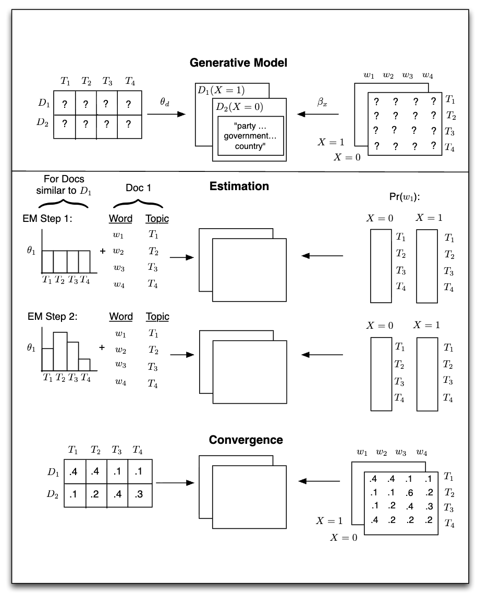
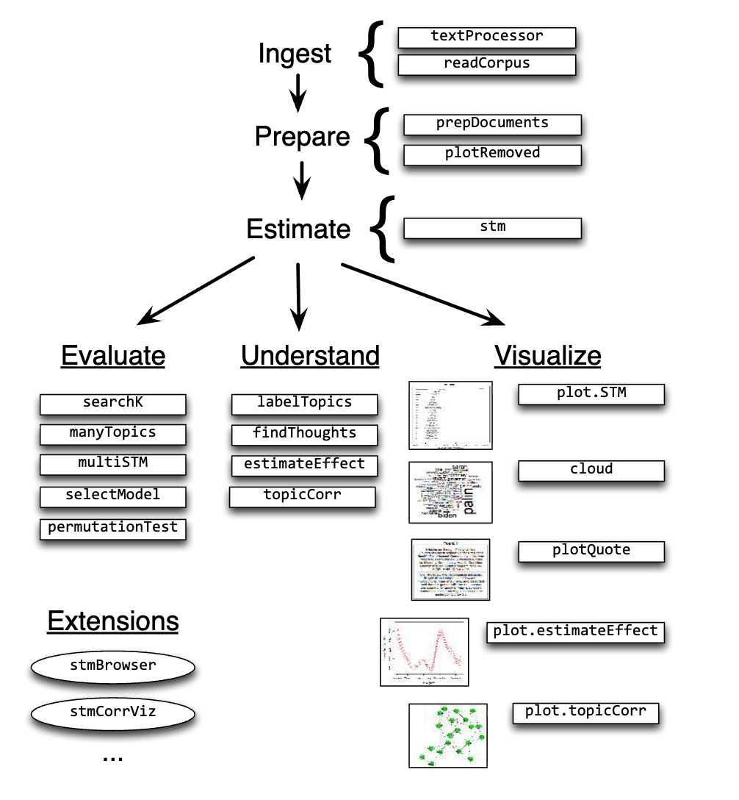

```{r setup, include=FALSE}
knitr::opts_chunk$set(echo = TRUE, fig.width=8, fig.height=4)
options(scipen = 0, digits = 3) 
```

# What is Structural Topic Modeling (STM)

Topic modeling is an unsupervised machine learning approach used to identify topics or themes within a corpus of text. It automatically clusters words that tend to co-occur across documents, with the aim of identifying groups of terms that represent distinct latent topics.

STM is one of the most widely used topic modeling variants. Its key innovation is incorporating corpus metadata (e.g., time, author, publication outlet) into the topic model.

# What research questions can STM answer?
In the social science domain, STM has been applied across multiple empirical contexts, including but not limited to: (1) analyzing topics or frames in mass media publications, historical documents, and policy materials; (2) examining open-ended survey responses to measure citizen opinion; and (3) studying public opinion using social media data. 

The key goal of the STM is to allow researchers to discover latent topics while estimating their relationships with the metadata. As a result, STM enables not only **descriptive questions** about what themes are present in a corpus, but also inferential **hypothesis testing** regarding how topics vary across metadata attributes.

# What is the output of STM?
Like other topic models, STM is a generative model of word counts. It assumes a three-level framework consisting of documents, topics, and words, with STM additionally allowing documents to carry metadata. 

In this framework (referring to the figure below), a topic is defined as a mixture of words, where each word has a probability of belonging to that topic. Likewise, a document is defined as a mixture of topics, meaning that a single document can simultaneously contain multiple themes. In the end, the topic proportions in a document sum to one, and the word probabilities within a topic also sum to one.



# The pipline of STM in R

## "stm" package


*Dear Dr. Huang, for this section, I believe Dr. Lukito has offered a great pipline with code. I have nothing new to add. 
Here is the [section](https://jolukito.quarto.pub/j381m-textbook/94-stm.html).
For the dataset within code, it has been included in this folder (see "exercise_data_reddit_inflation_political.csv").*

# How to evaluate STM
In STM, we typically adopt a **human-in-the-loop** approach for model refinement. This often involves adjusting the number of topics (K) by reviewing the most relevant words for each topic to assess their semantic interpretability. If topics look too broad, we lower K; if they look too mixed, we raise K. We repeat this until the topics become interpretable.

We can also look at a few model diagnostics: **held-out likelihood, residuals, semantic coherence, and the lower bound** to help us compare models across different values of K. However, we should realize these measures just give us a sense of the trade-offs between model fit and topic quality, which are not equal to absolute decision-makers. They maybe helpful for narrowing down the search space (K value), but are not always superior to human judgement/interpretation.

# Limitations of topic models
No method is perfect, thus it is important to recognize both the advantages and the limitations of any method/technique when we are learning (especially unsupervised methods in computational analysis.) 

Regarding topic modeling, *first,* we should realize topic models are not designed to produce highly nuanced or definitive classifications of text. Recent advances in LLM-assisted topic modeling are helping address some of these challenges, but the fundamental interpretive nature of the method remains. *Second,* topic models can also be misused when their outputs are taken as objective representations of meaning. For this reason, it is essential that researchers either have strong theoretical expectations about the topical structure of a corpus, or carefully validate their models through a cross-validation approach.

# Bonus: Family of topic models
It’s also worth keeping in mind that STM is only one kind of topic model. There are many other variants, each with its strengths. Traditional ones include LDA and DTM, and more recent models use transformers—like BERTopic and other AI-assisted approaches, and even multimodal topic modeling. Below lists a few examples for comparison:

[BERTopic](https://github.com/MaartenGr/BERTopic)

[Dynamic Topic Modeling](https://maartengr.github.io/BERTopic/getting_started/topicsovertime/topicsovertime.html)

[Multimodal Topic Modeling](https://maartengr.github.io/BERTopic/getting_started/multimodal/multimodal.html#images-only)

# References
[Roberts, M. E., Stewart, B. M., & Tingley, D. (2019). Stm: An R package for structural topic models. Journal of statistical software, 91, 1-40.](https://cran.r-project.org/web/packages/stm/vignettes/stmVignette.pdf)

[Roberts, Stewart, Tingley, Lucas, Leder-Luis, Gadarian, Albertson, and Rand. "Structural topic models for open-ended survey responses." American Journal of Political Science. 2014.](https://onlinelibrary.wiley.com/doi/abs/10.1111/ajps.12103)

