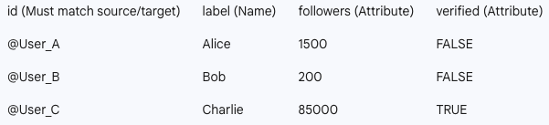
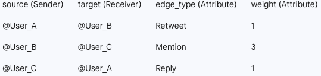

```{r setup, include=FALSE}
# this is the chunk for setting up the environment. It will not be included in the final output (include=FALSE). Run it before you run the following chunks.
knitr::opts_chunk$set(echo = TRUE, fig.width=8, fig.height=4)
options(scipen = 0, digits = 3)  # controls base R output
```

\pagebreak

# Objectives {-}

Welcome back to J381M! Today we will keep learning more advanced network analysis techniques. 

Content of today:

0. Set-up: 
    + Start a new R script in R studio in your j381m project folder and clean the environment before you start (use `rm = list (ls())`)
    + Make sure you have included the data files in your project folder (`political_blogs.gml`, `bipartite_example.csv`)
    + Install and library required packages, `igraph` 

1. Community detection in GoT network
    + What is a community in a network?
    + How to identify communities in a network?
    + How to visualize communities in a network?

2. Replicate a classic network study: Adamic and Glance (2005)
    + Explore the data
    + Visualize the ideological split
    + Calculate the within-group vs cross-group links
    + Calculate homophily and assortativity
    + Use community detection as a structure-based test for polarization
    
Let's get started!

# Recap a bit {-}

```{r GoT, message=F}
library(igraph) # Using the package of "igraph" for networks in R.
GoT <- read.csv("GoT_unweighted.csv") # read the data, which is an edge list of character interactions in Game of Thrones. The first column is the source, and the second column is the target.
head(GoT) 
```

```{r visual, message=F}
# creates a graph from the edge list
g <- graph_from_edgelist(as.matrix(GoT), # rearranging the data as matrix 
                          directed = F) # directions are not specified
g # "g" here is the graph object. You can check its properties by using the summary function.
summary(g)

# visualization
png(filename = "GoT.png", width = 1600, height = 1400) ## save it to png

plot(g, # the graph object
     vertex.size = 5, # size of nodes
     vertex.color = "pink", # color of nodes
     vertex.label.cex = 1, # size of labels
     vertex.label.color = "black", # color of labels
     layout = layout.fruchterman.reingold) # layout of the graph

dev.off() ## end of the output
```

# Community detection with GoT {-}

This is a network of GoT characters, and now we try to detect some communities in this network. A community is a group of nodes that are more densely connected to each other than to the rest of the network. In this GoT network, we might expect to find communities corresponding to different houses or factions in the story (e.g., House Stark, House Lannister, etc.).

Before we can apply a community detection algorithm, we need to check whether this network is directed or undirected, and whether it is connected or not. 

```{r got community, message=F}
is_directed(g) # the network is undirected
is_connected(g) # the network is connected (no disconnected components)
```

To find groups in this network, we can apply an algorithm that uses the betweenness of edges. The `cluster_edge_betweenness()` function in `igraph` implements this algorithm. It works by iteratively removing edges with the highest betweenness until the network is split into communities. The resulting communities are stored in a `communities` object, which contains information about the membership of each node and the size of each community. 

```{r GoT community, message=F}
# find communities using the edge betweenness algorithm
betw <- cluster_edge_betweenness(g)
length(betw)
sizes(betw)

# visualize the communities
num_communities <- length(betw)
my_colors <- sample(rainbow(num_communities))
node_colors <- my_colors[betw$membership]

png(filename = "GoT_community.png", width = 1600, height = 1400) ## save it to png
plot(g, vertex.size = 5, vertex.color = node_colors, vertex.label.cex = 1, vertex.label.color = "black", layout = layout.fruchterman.reingold)
dev.off() ## end of the output

```
# Replicate a classic network study: Adamic and Glance (2005) {-}

Now, let's try to replicate a classic network study by Adamic and Glance (2005) on the political blogs network. This paper is saved in the same folder of the handout. They collected a dataset of political blogs in 2004, and classified them as liberal or conservative based on their content. They then analyzed the linking patterns between these blogs to understand the structure of the political blogosphere.

## Explore the data {-}

```{r read data, message=F}
# read the data
blogs <- read_graph("political_blogs.gml", format = "gml") # the gml file is a common format for network data. you can open it with a plain text editor to see how the data is structured.
summary(blogs)
```
Recap on what we learned again: how to read this summary output?

Here, the ideology of blogs is encoded in the node attribute “value”. Blogs classified as liberal have value = 0, and value = 1 if they are conservative:

```{r value, message=F}
table(V(blogs)$value) # table() is a base R function that counts the frequency of each unique value in a vector. Here, we are using it to count how many blogs are classified
```

This table tells us that there are slightly more liberal blogs in this network.

We can add an additional node attribute by calculating the in-degree centrality of blogs (i.e., the number of other blogs sending links to the focal blog). This the influence of each blog in this network. 

```{r in-degree centrality, message=F}
V(blogs)$degree <- degree(blogs, mode = "in")
summary(V(blogs)$degree)
```

## Connectedness and self-loops {-}

We should check the connectedness of this network before we apply the community detection algorithm.

```{r connectedness, message=F}
is_connected(blogs) 
```

This indicates that this network has multiple disconnected components. We can apply the community detection algorithm to the largest connected component of this network.

```{r LCC, message=F}
# find the largest connected component
comp <- components(blogs)
comp$csize  # size of each connected component
which.max(comp$csize) # find the index of the largest component
largest_component <- which.max(comp$csize) # assign a variable for the index of the largest component
LCC_blogs <- induced_subgraph(blogs, which(comp$membership == largest_component)) # specify this largest component as the subgraph of the original graph
summary(LCC_blogs)
is_connected(LCC_blogs, mode = "weak") # now we are good to go!
```
The largest component has size N = 1222. From now on, we will use `LCC_blogs` for most visualizations and community detection.

We also want to remove the self-loops in this network, which are links from a blog to itself and might affect some network measures and algorithms. 

```{r self-loop, message=F}
LCC_blogs <- igraph::simplify(LCC_blogs, remove.loops = T) # sometimes there are multiple packages that have a function called simplify. This kind of error is common, and can be resolved by specifying the package name before the function name, like igraph::simplify.
summary(LCC_blogs)
```

Because the graph is directed, we will keep the directed version for some analyses. But for layout and some community algorithms, it is often helpful to create an undirected version:

```{r undirected version, message=F}
LCC_blogs_u <- as_undirected(LCC_blogs, mode = "collapse")
summary(LCC_blogs_u)
```

## Visualize the ideological split {-}

```{r ideology plot, message=F}
# recalculate in-degree on the LCC
V(LCC_blogs)$degree <- degree(LCC_blogs, mode = "in")

# ideology colors: liberal = blue, conservative = red
V(LCC_blogs)$color <- ifelse(V(LCC_blogs)$value == 0, "blue", "red")

# use the undirected version to compute a stable layout
set.seed(123)
coords <- layout_with_fr(LCC_blogs_u)

par(mar = c(1,1,2,1))
plot(LCC_blogs,
     vertex.size = sqrt(V(LCC_blogs)$degree),
     vertex.color = V(LCC_blogs)$color,
     vertex.label = NA,
     layout = coords,
     edge.arrow.size = 0.1,
     main = "Political blogs: ideology and in-degree")
legend("topleft",
       legend = c("Liberal", "Conservative"),
       col = c("blue", "red"),
       pch = 19,
       pt.cex = 1.3,
       bty = "n")
```
**What do you see?**  

Do the red and blue blogs appear mixed together, or do they form two large blocs? This is the first visual clue about polarization.

## Calculate the within-group vs cross-group links {-}

A major finding in Adamic and Glance (2005) is that most links stay **within ideology** rather than crossing from left to right or right to left.

We can calculate this directly from the edge list stored inside the graph object.

```{r within cross ideology, message=F}
# identify the ideology at both ends of each edge
edge_ends <- ends(blogs, E(blogs), names = FALSE) # the ends() function returns a matrix where each row corresponds to an edge, and the two columns correspond to the source and target nodes of that edge. The names = FALSE argument means that we want the output to be numeric indices of the nodes rather than their names.
head(edge_ends) # now, you see something similar to the GoT dataset

edge_tab <- table(
  Source = V(blogs)$value[edge_ends[,1]],
  Target = V(blogs)$value[edge_ends[,2]]
) # this code creates a contingency table (cross-tab) of the "from" and "to" variables. The "Source" variable is determined by looking up the ideology value of the source node for each edge, and the "Target" variable is determined by looking up the ideology value of the target node for each edge. The resulting table will show the counts of edges that go from lib to lib, lib to con, con to lib, and con to con.
edge_tab

dimnames(edge_tab) <- list(
  from = c("liberal", "conservative"),
  to   = c("liberal", "conservative")
) # now we add column and row names to the table for better readability 

edge_tab
round(prop.table(edge_tab), 3)
```

## Homophily and assortativity {-}

Another way to quantify ideological segregation is to use **assortativity**.  
Assortativity asks whether nodes tend to connect to **similar** nodes.

Here, "similar" means sharing the same ideology (value).

```{r assortativity ideology, message=F}
table(V(blogs)$value) # check the distribution of the attribute first
ideo <- factor(V(blogs)$value) # turn the numeric variable into a factor variable, which is required for calculating nominal assortativity
assortativity.nominal(blogs, ideo, directed = TRUE) # assortativity.nominal() is a function in igraph that calculates the assortativity coefficient for a nominal (categorical) attribute. The first argument is the graph object, the second argument is the attribute vector (in this case, the ideology factor), and the directed argument specifies whether to consider the direction of edges when calculating assortativity.
```

A **positive** assortativity score means that liberal blogs tend to link to liberal blogs, and conservative blogs tend to link to conservative blogs. The closer the score is to 1, the stronger the assortative mixing.

We can also calculate **degree assortativity**: do high-degree blogs tend to link to other high-degree blogs?

```{r assortativity degree, message=F}
assortativity.degree(blogs, directed = TRUE)
```

The negative value indicates that high-degree blogs tend to link to low-degree blogs, which is consistent with a star-like structure where a few central blogs receive many links from peripheral blogs.

## Community detection as a structure-based test {-}

So far, we used the ideology labels that came with the data.  
Now let's ask a different question:

> If we ignored ideology labels completely, would the network structure itself still reveal communities?

This is exactly where **community detection** becomes useful. We introduce two algorithms here: Walktrap and Infomap. Both of them can be applied to directed networks, but they have different underlying assumptions about how communities are formed.

- `cluster_walktrap()` works on random walks and **ignores edge direction**
- `cluster_infomap()` is based on information flow and **can take direction into account**

Let's try both.

```{r walktrap infomap, message=F}
walktrap <- cluster_walktrap(LCC_blogs_u, modularity = TRUE)
infomap  <- cluster_infomap(LCC_blogs)

length(walktrap)
length(infomap)

sizes(walktrap)
sizes(infomap)[1:15]
```
The two methods may return different numbers of communities because they formalize "community" differently.

Now let's visualize the results.

```{r community plots, message=F}
par(mfrow = c(1,2), mar = c(0,0,3,0))

plot(LCC_blogs_u,
     vertex.size = sqrt(V(LCC_blogs)$degree),
     vertex.color = membership(walktrap),
     vertex.label = NA,
     layout = coords,
     edge.arrow.size = 0,
     main = "(a) Walktrap")

plot(LCC_blogs,
     vertex.size = sqrt(V(LCC_blogs)$degree),
     vertex.color = membership(infomap),
     vertex.label = NA,
     layout = coords,
     edge.arrow.size = 0.1,
     main = "(b) Infomap")

par(mfrow = c(1,1))
```
**Questions:**

1. Do both methods recover a broad left-right split?
2. Which method gives a coarser partition, and which gives a finer one?
3. Why might a directed method like Infomap find more communities?

## Compare detected communities to ideology {-}

To see whether the detected communities align with ideology, we can cross-tabulate community membership and blog ideology.

```{r community ideology table, message=F}
walktrap_tab <- table(
  community = membership(walktrap),
  ideology = V(LCC_blogs)$value
)

colnames(walktrap_tab) <- c("liberal", "conservative")

# show the largest communities first
walktrap_tab[order(rowSums(walktrap_tab), decreasing = TRUE), ]
```

It is often easier to interpret proportions within each detected community:

```{r community ideology proportions, message=F}
round(prop.table(walktrap_tab, margin = 1), 3)
```

If many communities are dominated by one ideology, that suggests that the network structure is strongly aligned with political identity.

As a quick reminder from last week: assortativity can also be calculated using **community membership** itself.

```{r assortativity community, message=F}
assortativity.nominal(LCC_blogs_u, membership(walktrap), directed = FALSE)
```

This value is usually positive, because nodes inside the same community are, by construction, more likely to be connected.

## Summary {-}

Using the political blog network, we have now replicated the **structural** part of the Adamic and Glance study:

1. The blogosphere is visibly split into liberal and conservative regions.
2. Most links stay **within ideology** rather than crossing between left and right.
3. Community detection recovers a similar broad division even when we ignore ideology labels. (Robustness!)

This shows how network analysis can be used to answer a real research question with real data.

# Bonus learning (1): How do we construct a network? {-}

For example, if you are using digital trace data, you can first construct a node list and an edge list. The node list contains the information of each node (e.g., id, name, attributes), and the edge list contains the information of each edge (e.g., source, target, weight). Then you can use the `graph_from_data_frame()` function in `igraph` to create a network object from the node list and edge list.





```{r construct, message=F}
# create the edge list
edges <- data.frame(
  source = c("@User_A", "@User_B", "@User_C"),
  target = c("@User_B", "@User_C", "@User_A"),
  interaction_type = c("Retweet", "Mention", "Reply")
)

# create the node list
nodes <- data.frame(
  id = c("@User_A", "@User_B", "@User_C"),
  label = c("Alice", "Bob", "Charlie"),
  followers = c(1500, 200, 85000)
)

# compose a network!
# The 'd' argument takes the edges. 
# The 'vertices' argument takes the nodes.
my_network <- graph_from_data_frame(d = edges, vertices = nodes, directed = TRUE)

# export it to a .gml or .graphml file so other software like Gephi can read it; .graphml is a more modern version
write_graph(my_network, file = "example_social_media_network.gml", format = "gml")

# you can also just save the node list and edge list as .csv files and import them into Gephi, which can automatically construct the network for you
```

# Bonus learning (2): Bipartite network? {-}

A bipartite network is a special type of network that consists of two distinct sets of nodes, where edges only exist between nodes from different sets. For example, 

```{r bipartite, message=F}
data <- read.csv("bipartite_example.csv") # this is a simple dataset of actors and movies. The first column is the actor name, and the second column is the movie name. Each row represents an edge between an actor and a movie.
g <- graph.data.frame(data, directed = F)
summary(g)

par(mar = c(0,0,0,0)) 
coords <- layout_with_fr(g) 
plot(g, vertex.size = 0.5, layout = coords)

## here we specify that the nodes
## in column 1 are one type of nodes (i.e. actors)
V(g)$type <- V(g)$name %in% data[,1]
g

## now we can project the network of actors
## or the network of movies: 

bipartite.projection(g) ## projection 1 is for movies; projection 2 is for actors
g_movies <- bipartite.projection(g)$proj1
g_actors <- bipartite.projection(g)$proj2

coords <- layout_with_fr(g_movies) 
plot(g_movies, edge.width = E(g_movies)$weight,
     layout = coords)

coords <- layout_with_fr(g_actors) 
plot(g_actors, edge.width = E(g_actors)$weight,
     vertex.size = 0.5,layout = coords)
```
#Bonus learning (3): Modeling with networks {-}


So far, all of our analysis has been **descriptive**:

- we visualized a network
- we measured assortativity
- we compared subgraphs
- we detected communities

But researchers often want to go one step further and ask:

- Are same-ideology links significantly more likely than cross-ideology links?
- Does ideology still matter after accounting for degree or other node characteristics?
- Are there network dependencies that violate standard regression assumptions?

These are exactly the kinds of questions that lead to methods such as **QAP/MRQAP**, **ERGM**, and other models for network data. For extended learning on this topic, you can check out the following resources:

- QAP/MRQAP: [sna package](https://cran.r-project.org/web/packages/sna/index.html)
- ERGM: [statnet package](https://statnet.org/)

