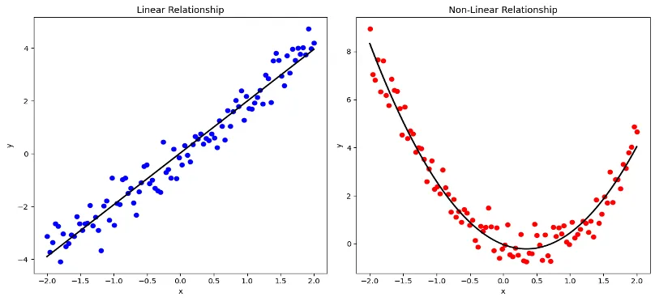
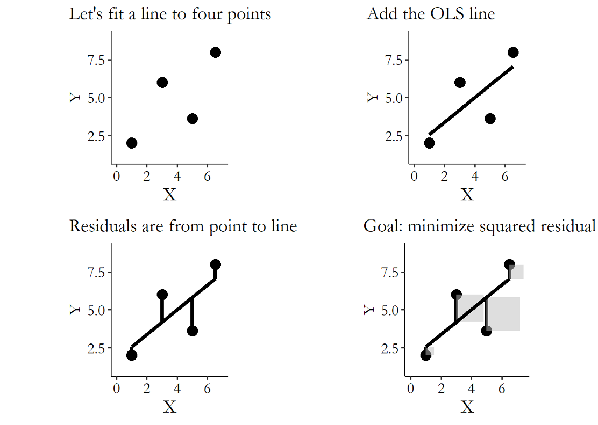
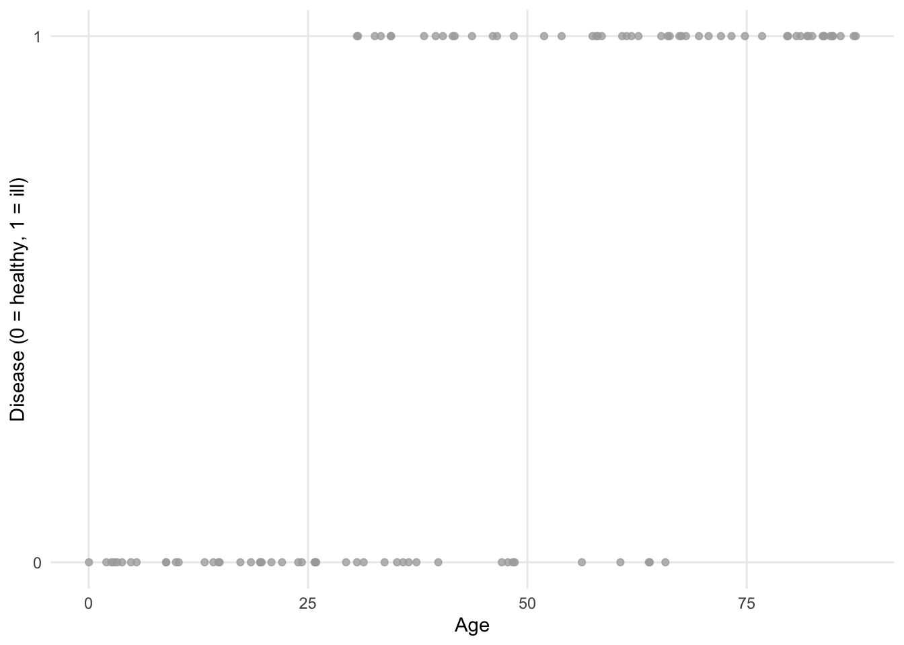

```{r setup, include=FALSE}
# this is the chunk for setting up the environment. It will not be included in the final output (include=FALSE). Run it before you run the following chunks.
knitr::opts_chunk$set(echo = TRUE, fig.width=8, fig.height=4)
options(scipen = 0, digits = 3)  # controls base R output
```

\pagebreak

# Objectives {-}

Welcome back to J381M! Today we will review some basic knowledge of linear regression and logistic regression. We will also try to conduct these two kinds of regressions in R! 

Contents for today:

0. Basic knowledge of linear regression:  
    + Simple linear regression
    + Multiple linear regression
    
1. Conduct linear regression in R:
    + the lm function
    + How to interpret the results

2. Logistic regression:
    + Basic knowledge
    + Conduct logistic regression in R
    + How to interpret the results

Now let's start!

# Relationship between two variables {-}

In social science research, we are usually curious about the relationship between two variables. 

For example:

* The toxicity score of one tweet & user engagement metrics (retweet, like, and comment)
* Political attitudes/engagement & media exposure
* Risk perception & health protective behaviors

We can use the values of one variable X to predict the values of another Y. 

We call this explaining Y using X. 

While there are many ways to do this, one is to fit a line or shape that describes the relationship.

Therefore, the first step will be:

* Determine whether or not there is a relationship between the variables of interest
* Determine whether there is a linear or nonlinear relationship



Linear regression attempts to model the relationship between two variables by fitting a linear equation to observed data. 

One variable is considered to be an explanatory variable, and the other is considered to be a dependent variable.

**Linear regression does not require X to be continuous.**
**The key requirement is that Y is continuous/numeric.**

If your Y is categorical, you should use logistic regression instead of linear regression.

We will talk about that later.

# Simple Linear Regression {-}

In algebra, a straight line is written as:

$$
Y = a + bX
$$

a = intercept (value of Y when X = 0)  

b = slope (how much Y changes when X increases by 1)

In statistics, outcomes are not perfectly predictable.

We therefore write a linear equation: 

$$
Y=\beta_0+\beta_1X+\epsilon
$$

$\beta_0$ = intercept (population parameter)

$\beta_1$ = effect of X on Y

$\epsilon$ = error term (unobserved influences)

The most common method for fitting a regression line is the method of **ordinary least-squares (OLS)**. 
This method calculates the best-fitting line for the observed data by minimizing the sum of the squares of the vertical deviations from each data point to the line.



Once we have this best-fitting line, we can ask a simple question:
How well does the line actually explain the data?

The **$R^2$ statistic** answers this question. 

It tells us how much of the variation in the outcome variable can be accounted for by the regression line, compared to making no prediction at all.

In simple terms:
**$R^2$ measures how much better the regression line predicts $Y$ than just using the average value of $Y$.**

- If the points lie very close to the line, the model explains a lot → $R^2$ is high.  
- If the points are widely scattered around the line, the model explains little → $R^2$ is low.

An $R^2$ of 0 means the line does no better than guessing the average, while an $R^2$ close to 1 means the line captures most of the pattern in the data.


# Multiple Linear Regression {-}

What if you want to explore the relationship between multiple X and Y?

For example, the multimodal characteristics of TikTok videos and user engagement metrics.

We can use multiple linear regression.

Predict the response variable using more than one predictor variable.

$$
Y = \beta_0 + \beta_1 X_1 + \beta_2 X_2 + \cdots + \beta_p X_p + \epsilon
$$

# Conduct Linear Regression in R {-}

OLS is implemented in R by the **lm** function

Now let's try to conduct linear regression using the lm function in R!

Notes: We will use the Prestige Data. This dataset includes 102 observations. Each observation is a kind of occupation (e.g., professor, doctor, accountant). There are six variables: education, income, women, prestige, census, type. Each variable represents the average level of this occupational group at the social level. For example, the *prestige* variable refers to the general prestige score for occupation after large-scale surveys. The *education* variable refers to the average education years of occupational incumbents.

```{r}
install.packages("car", repos = "https://cloud.r-project.org") ##if this is a new package we need to install first. 
library(car) #We have to library the package every time we use.
library(ggplot2) # for some amazing looking graphs
library(cowplot) # arranging plots into a grid
```

# Observe the data

```{r}
# Inspect and summarize the data.
head(Prestige) # First 6 rows of dataset
```

# Visualizing the data: scatterplot

```{r}
plot_income <- ggplot(data = Prestige, aes(x = prestige, y = income, col = type)) + geom_point()
plot_education <- ggplot(data = Prestige, aes(x = prestige, y = education, col = type)) + geom_point()
plot_women <- ggplot(data = Prestige, aes(x = prestige, y = women, col = type)) + geom_point()
plot_census <- ggplot(data = Prestige, aes(x = prestige, y = census, col = type)) + geom_point()
plot_grid(plot_income, plot_education, plot_women, plot_census, labels = "AUTO")
```

After observation, what hypotheses can you propose?

Let's take Figure B as an example!

H1: Prestige is positively associated with years of education.
（The null hypothesis: Prestige has no effect on years of education.)

# Simple linear regression

```{r}
reg1 <- lm(prestige ~ education, data = Prestige)
summary(reg1)
```

Let's interpret the model result!

## Estimate

The estimate is the regression coefficient (β).

It tells us how much Y changes, on average, when the predictor increases by one unit.

Example: β = 5.361

Meaning: A one-unit increase in education is associated with an average increase of 5.361 units in the prestige.

## Standard Error (Std. Error)

The standard error measures how uncertain the estimate is.

It tells us how much the coefficient would vary if we repeated the study with different samples.

Small standard error → more precise estimate

Large standard error → less precise estimate

## p value

A p-value tells us how likely we would observe this result if there were actually no relationship.

A small p value suggests the relationship is statistically significant.

| Code | p-value range | Interpretation |
|---:|:---|:---|
| `***` | p < 0.001 | highly significant |
| `**`  | 0.001 ≤ p < 0.01 | very significant |
| `*`   | 0.01 ≤ p < 0.05 | significant |
| `.`   | 0.05 ≤ p < 0.1 | marginally significant |
| (blank) | p ≥ 0.1 | not significant |

## R-squared

R² measures how well the regression model explains the data.

It represents the proportion of variation in the outcome variable that is explained by the predictors.

Example: R² = 0.7228

Meaning: About 72% of the variation in the outcome variable can be explained by education in this model.

## Residual

Residuals are the differences between the observed values and the values predicted by the regression model.

$$
\text{Residual} = Y_{\text{observed}} - Y_{\text{predicted}}
$$

In simple terms:

A residual tells us how far each data point is from the regression line.

Positive residual → the model underestimated the outcome

Negative residual → the model overestimated the outcome

The summary (Min, 1Q, Median, 3Q, Max) shows how these prediction errors are distributed.

## t value

The t value compares the estimate to its uncertainty:

$$
t = \frac{\text{Estimate}}{\text{Standard Error}}
$$

It indicates how far the estimate is from zero in standard-error units.

A larger absolute t value means stronger evidence that the effect is not zero.

## degrees of freedom

Degrees of freedom tell us how much independent information is available to estimate the model.

For example: Residual standard error: 9.1 on 100 degrees of freedom

This means: After estimating the regression line, we still have 100 independent pieces of information left to estimate the model's error.

## F-statistic

The **F-statistic** tests whether the regression model is useful overall.

For example: F-statistic: 261 on 1 and 100 DF, p-value < 2e-16

This means: The model using education explains much more variation in prestige than simply guessing the average prestige for everyone.

A large F value (like 261) indicates that the model performs far better than a model with no predictors.

The very small p-value tells us that this improvement is extremely unlikely to be due to random chance.

In short: The model is statistically meaningful overall.

# Multiple Linear Regression

## Exampple 1: Prestige

```{r}
reg2 <- lm(prestige ~ education + log(income) + women + census, data = Prestige)
summary(reg2) 
```

## Exampple 2: Tweets

Let's try a different dataset!

Remember we just talked about the toxicity score of one tweet & user engagement metrics (retweet, like, and comment).

We will use the *DMO social media engagement dataset*. The dataset consists of 21677  tweets posted from 25th March 2019  to 31st January 2022 by 23 Destination marketing organizations (DMO). The tweets were collected to study the social media content strategy of DMOs.

If you want to do more practice, here is the link:
https://data.mendeley.com/datasets/bfk3hvdcnt/1

We want to explore the relationship between the linguistic features of tweets and user engagement.

### Key variables

| Variable | Category | Meaning |
|-----------|------------|----------|
| `retweet_count` | User Engagement | Number of times the tweet was retweeted |
| `reply_count` | User Engagement | Number of replies to the tweet |
| `like_count` | User Engagement | Number of likes received |
| `quote_count` | User Engagement | Number of quote retweets |
| `id` | Tweet Information | Unique tweet ID |
| `Date` | Tweet Information | Date the tweet was posted |
| `Followers` | Tweet Information | Number of followers at the time of posting |
| `Status text` | Tweet Information | Full tweet text |
| `WC` | Tweet Information | Word count (number of words in the tweet) |
| `Clout` | Linguistic Feature | Level of confidence or authority expressed |
| `Cognition` | Linguistic Feature | Amount of analytical or thinking-related language |
| `Affect` | Linguistic Feature | Overall emotional language used |
| `tentat` | Linguistic Feature | Tentative language (e.g., maybe, perhaps) |
| `Drives` | Linguistic Feature | Words related to motivation or goals |
| `insight` | Linguistic Feature | Insight-related words (e.g., realize, understand) |
| `cause` | Linguistic Feature | Causal language (e.g., because, therefore) |
| `discrep` | Linguistic Feature | Discrepancy words (e.g., should, would) |
| `certitude` | Linguistic Feature | Certainty-related language (e.g., always, definitely) |

```{r}
# Read CSV file
data <- read.csv("DMO.csv")

# View the structure of the dataset
str(data)

```

### Fit the model

```{r}
# Fit multiple linear regression model
reg3 <- lm(retweet_count ~ Followers + WC + Clout + Cognition +
              Affect + tentat + Drives + insight +
              cause + discrep + certitude,
            data = data)

# View model results
summary(reg3)
```

### Interaction time

Can you interpret the results? 

Notes:
When the model is not ideal, we may make such changes:

* log-transform Y
* try **Poisson Regression** instead
* try **Negative Binomial Regression** instead

# Logistic Regression {-}

Sometimes the dependent variable is binary (0 or 1).

For example:
The impact of age on whether or not a patient has a certain disease (outcome: ill or healthy).




In this case, we shouldn't use linear regression.


Here is how the points are fitted using a binary logistic regression.


The logit function can relate the probability of occurrence of an event (bounded between 0 and 1) to the linear combination of independent variables.

It can also ensure that no matter in which range the X values are located, Y will only take numbers between 0 and 1.

Logistic regression is part of a broader type of model called generalized linear models (GLM).

* Binary logistic regression is used when the goal is to estimate the relationship between a binary dependent variable (= two outcomes), and one or more independent variables (of any type).

* Multinomial logistic regression is used when the goal is to estimate the relationship between a nominal dependent variable with three or more unordered outcomes, and one or more independent variables (of any type).

* Ordinal logistic regression is used when the goal is to estimate the relationship between an ordinal dependent variable with three or more ordered outcomes, and one or more independent variables (of any type).

# Conduct Logistic Regression in R {-}

Example: A researcher is interested in how variables, such as GRE (Graduate Record Exam scores), GPA (grade point average) and prestige of the undergraduate institution, effect admission into graduate school. The response variable, admit/don’t admit, is a binary variable.

```{r}
data <- read.csv("https://stats.idre.ucla.edu/stat/data/binary.csv")
## view the first few rows of the data
head(data)
```

The code below estimates a logistic regression model using the glm (generalized linear model) function. 

First, we convert rank to a factor to indicate that rank should be treated as a categorical variable.

```{r}
data$rank <- factor(data$rank)
```

```{r}
logit <- glm(admit ~ gre + gpa + rank, data = data, family = "binomial")

# Why "family = binomial"?

# Because the the dependent variable (admit) is binary.

# Remember we just said that Binary logistic regression is used when the goal is to estimate the relationship between a binary dependent variable (= two outcomes), and one or more independent variables (of any type).

# But if you want to conduct multinomial logistic regression or ordinal logistic regression, you need to use other libraries.

# If you need to conduct poisson regression (a count dependent variable), you can use: glm(y ~ x, data = data, family = "poisson").

summary(logit)
```

# Interpret the results of logistic regression

## Estimate

In logistic regression, the coefficient (Estimate) does **not** represent
a direct change in the outcome variable.

Instead, it represents the change in **log-odds** of the outcome.

The model estimates:nlog(odds of admission), not the probability directly.

### Continuous Predictors (e.g., GRE, GPA)

Example:

gre coefficient = 0.00226

Interpretation:

For a one-unit increase in GRE score,  
the **log-odds** of admission increase by 0.00226,  
holding other variables constant.

However, log-odds are difficult to interpret.

So we usually convert to **odds ratios**:

Odds Ratio = exp(coefficient)

* exp() is the exponential function.

For GRE: exp(0.00226) ≈ 1.002

This means: Each one-point increase in GRE increases the odds of admission by about 0.2%.

### Categorical Predictors (e.g., rank)

rank1 is the reference group.

Example: rank2 coefficient = -0.67544

Odds Ratio: exp(-0.67544) ≈ 0.51

Interpretation:

Students from rank 2 institutions have about 49% lower odds
of admission compared to rank 1 institutions,
holding other variables constant.

## z value

The z value plays the same role in logistic regression as the t value in linear regression.

## Deviance

* The null deviance measures how well the model performs when no predictors are included.

* The residual deviance measures how well the model performs after including the predictors.

## AIC (Akaike Information Criterion)

The AIC is a measure used to compare different models.

It balances two things:

* How well the model fits the data

* How complex the model is

Lower AIC → better model (when comparing models fit to the same data)